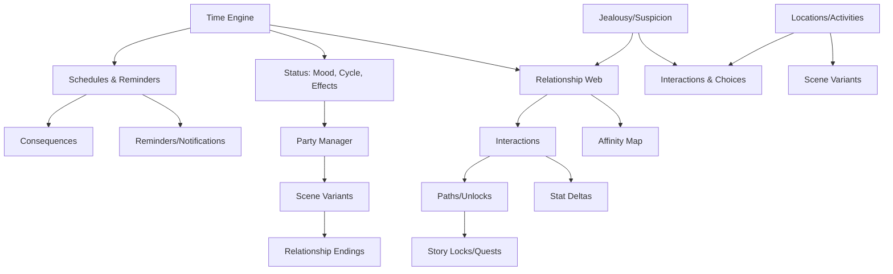
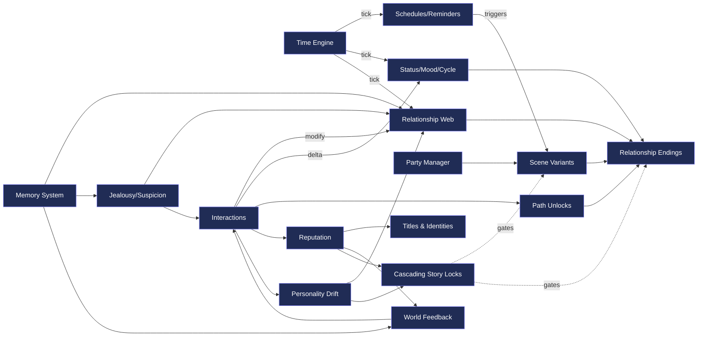

# Game Roadmap & Systems Ecosystem

This document tracks all systems, their dependencies, and our milestone plan for the Final Fantasy–inspired RPG/Dating SIM project.  
It combines **flowcharts**, **impact rules**, and a **delivery checklist**.

---

## 1) High-Level Systems Overview


---

2) Systems Dependency Map (who affects whom)

Rule of thumb:

Green edges = reads

Blue edges = writes/updates

Orange edges = gates/locks



---

## 3) Impact Rules — If we add X, it affects Y

```mermaid
graph LR

%% Interactions ripple
X1[Add a new Interaction] --> Y1[Updates Affection / Trust]
X1 --> Y2[Consumes Time Slot]
X1 --> Y3[May raise Suspicion if risky]
X1 --> Y4[Can unlock Path flags]
X1 --> Y5[Reputation change (local / party / global)]
X1 --> Y6[Personality Drift: traits shift]
X1 --> Y7[Memory Entry recorded]
Y5 --> Y8[Titles & Identities earned / removed]
Y5 --> Y9[World Feedback: NPC chatter, prices, access]
Y6 --> Y10[New dialogue or romance options]
Y7 --> Y11[Future Jealousy checks use past actions]

%% Locations & witnesses
X2[Add a new Location] --> Y12[Expands available actions]
Y12 --> Y13[Potential new witnesses]
Y13 --> Y7
Y13 --> Y9

%% Scheduling & consequences
X3[Schedule a Date] --> Y14[Creates reminder]
Y14 --> Y15[Triggers Scene at time]
Y15 --> Y16[On meet: apply scene outcomes]
Y14 --> Y17[On miss: affection penalty / suspicion / reputation loss]
Y17 --> Y9

%% Party composition & story gates
X4[Change Party] --> Y18[Locks or Unlocks scene variants]
Y18 --> Y19[Cascading Story Locks]
Y18 --> Y13
Y19 --> Y15
Y19 --> Y16

%% Suspicion tuning
X5[Raise Suspicion Rules] --> Y20[Jealousy more likely]
Y20 --> Y11
Y20 --> Y17

%% Reputation system edits
X6[Adjust Reputation Rules] --> Y21[New thresholds for Titles]
Y21 --> Y8
Y21 --> Y19
Y21 --> Y9

%% Title effects
X7[Add a new Title / Identity] --> Y22[Passive modifiers: prices, access, dialogue]
Y22 --> Y9
Y22 --> Y16

%% Personality drift design
X8[Define Drift Mapping] --> Y23[Traits unlock new paths / dialogue]
Y23 --> Y10
Y23 --> Y19
```

---

## 4) Milestones (checklist → ship in slices)

### Phase A — Foundation
- [ ] **A1 Time Engine:** slots/day, rest, HUD on Home
- [ ] **A2 Schedules & Reminders:** create & resolve events
- [ ] **A3 Interactions v1:** universal actions → stat deltas & time
- [ ] **A4 Jealousy/Suspicion v1:** witness rules, penalties
- [ ] **A5 Paths v1:** pair-specific unlocks
- [ ] **A6 Party Manager:** switchers + story locks

### Phase B — Content Hooks
- [ ] **B1 Locations & Activities:** open as story flags unlock
- [ ] **B2 NPC Schedules:** availability windows
- [ ] **B3 Scene Variants:** by party composition & path flags
- [ ] **B4 Relationship Endings:** branch per path/affection stats

### Phase C — Expansion
- [ ] **C1 Generational Play:** children, family trees
- [ ] **C2 Unique Systems per MC:** e.g., Nanaki can’t high-five but can be petted
- [ ] **C3 Advanced Mood/Sensitivities:** likes/dislikes evolve dynamically
- [ ] **C4 Complex Consequences:** missing story beats → cascades to endings

### Phase D — Identity & Consequence
- [ ] D1 Reputation System: global, local, and party reputation values
- [ ] D2 Titles & Identities: earned through milestones and behaviors
- [ ] D3 Personality Drift: characters evolve likes/dislikes, dialogue, and romance options
- [ ] D4 Memory System: NPCs and party recall past actions dynamically
- [ ] D5 Cascading Story Locks: entire questlines branch by reputation/personality
- [ ] D6 World Feedback: NPC chatter and environments reflect your choices

---

5) Notes & Philosophy

Keep sandbox feel: time advances by actions, not cutscenes.

Use stat progression + hidden modifiers for depth.

Paths replace flat affection: character-specific relationship identities.

Maintain modularity: systems can expand without rewriting everything.
