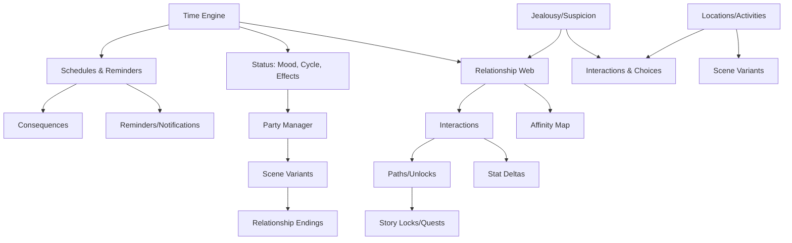
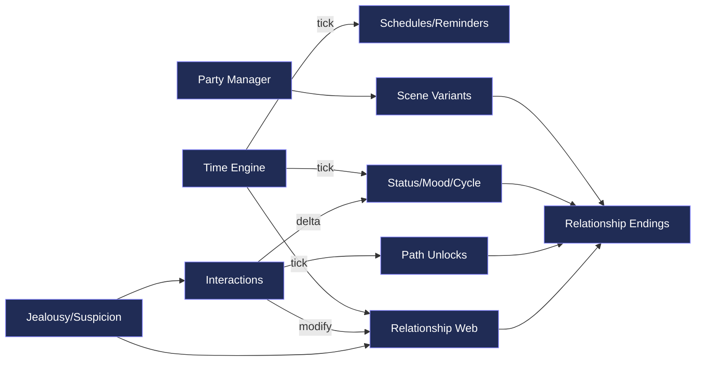

# Game Roadmap & Systems Ecosystem

This document tracks all systems, their dependencies, and our milestone plan for the Final Fantasy–inspired RPG/Dating SIM project.  
It combines **flowcharts**, **impact rules**, and a **delivery checklist**.

---

## 1) High-Level Systems Overview


---

2) Systems Dependency Map (who affects whom)

Rule of thumb:

Green edges = reads

Blue edges = writes/updates

Orange edges = gates/locks




---

3) Impact Rules — “If we add X, it affects Y”

```mermaid
graph LR
    X1[Add a new Interaction] --> Y1[Updates Affection/Trust]
    X1 --> Y2[Consumes Time Slot]
    X1 --> Y3[May raise Suspicion if risky]
    X1 --> Y4[Can unlock Path flags]

    X2[Add a new Location] --> Y5[Expands available actions]
    Y5 --> Y6[Potential new witnesses (jealousy graph)]

    X3[Schedule a Date] --> Y7[Creates reminder]
    Y7 --> Y8[Triggers Scene at time]
    Y8 --> Y9[On miss: affection penalty/jealousy]
    Y9 --> Y10[On meet: apply scene outcomes]

    X4[Change Party] --> Y11[Locks/Unlocks scene variants]
    Y11 --> Y12[Alters witness set for jealousy]

    X5[Raise Suspicion Rules] --> Y13[Jealousy more likely]
    X5 --> Y14[More penalties on being caught]

```

---

4) Milestones (checklist → ship in slices)

Phase A — Foundation

[ ] A1 Time Engine: slots/day, rest, HUD on Home

[ ] A2 Schedules & Reminders: create & resolve events

[ ] A3 Interactions v1: universal actions → stat deltas & time

[ ] A4 Jealousy/Suspicion v1: witness rules, penalties

[ ] A5 Paths v1: pair-specific unlocks

[ ] A6 Party Manager: switchers + story locks


Phase B — Content Hooks

[ ] B1 Locations & Activities: open as story flags unlock

[ ] B2 NPC Schedules: availability windows

[ ] B3 Scene Variants: by party composition & path flags

[ ] B4 Relationship Endings: branch per path/affection stats


Phase C — Expansion

[ ] C1 Generational Play: children, family trees

[ ] C2 Unique Systems per MC: e.g. Nanaki can’t high-five but can be petted

[ ] C3 Advanced Mood/Sensitivities: likes/dislikes evolve dynamically

[ ] C4 Complex Consequences: missing story beats → cascades to endings


---

5) Notes & Philosophy

Keep sandbox feel: time advances by actions, not cutscenes.

Use stat progression + hidden modifiers for depth.

Paths replace flat affection: character-specific relationship identities.

Maintain modularity: systems can expand without rewriting everything.
