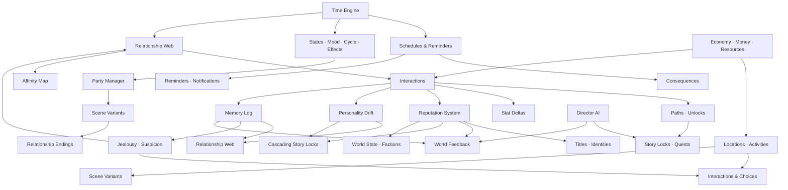
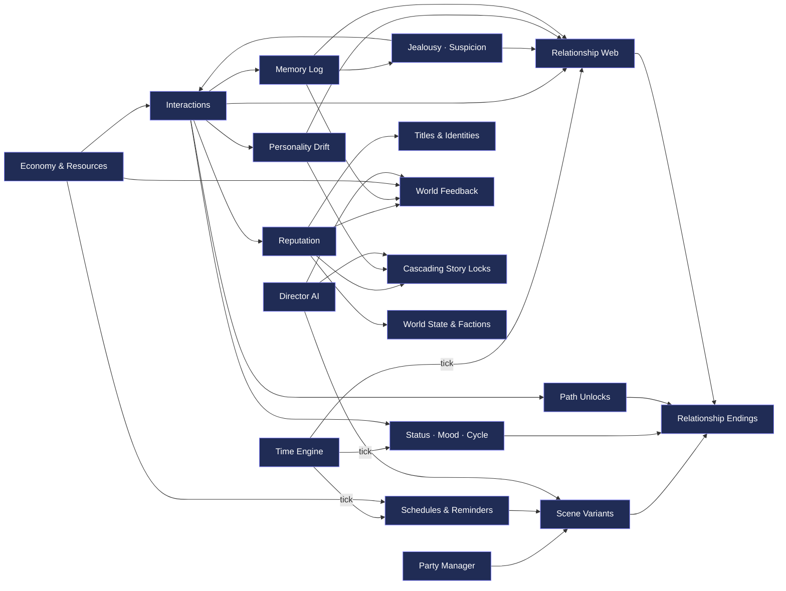
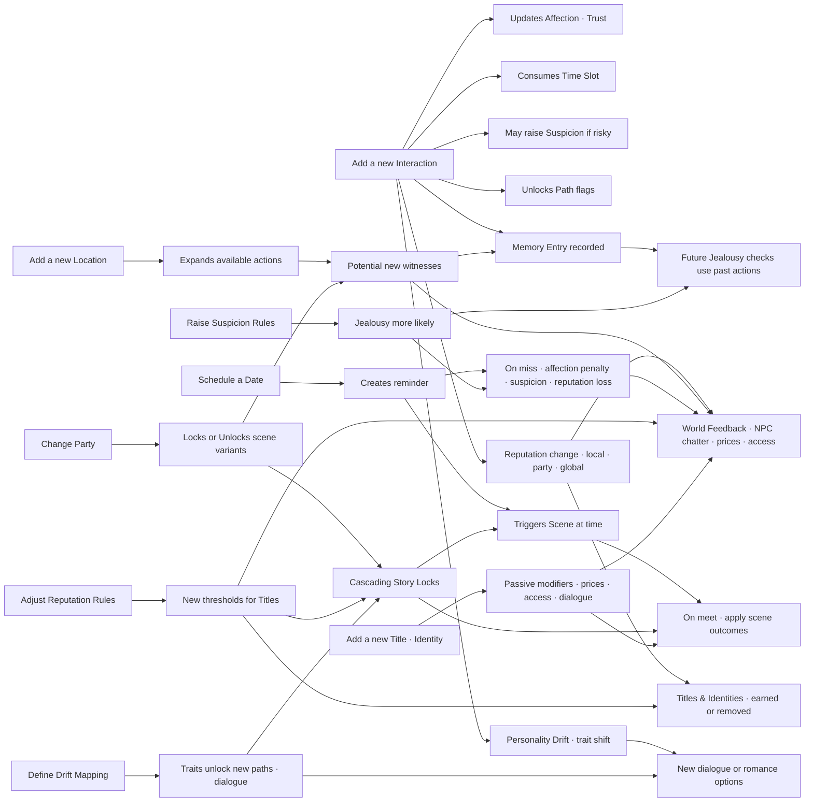
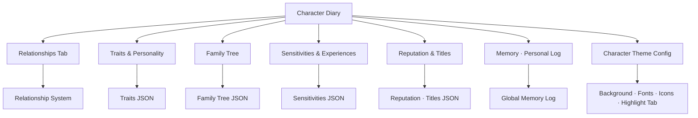

# Game Roadmap & Systems Ecosystem

This document tracks all systems, their dependencies, and our milestone plan for the Final Fantasy–inspired RPG/Dating SIM project.  
It combines **flowcharts**, **impact rules**, and a **delivery checklist**.

---

## 1) High-Level Systems Overview

---

2) Systems Dependency Map (who affects whom)

Rule of thumb:

Green edges = reads

Blue edges = writes/updates

Orange edges = gates/locks

---

## 3) Impact Rules — "If we add X, it affects Y"

---

## 4) Milestones (checklist → ship in slices)

### Phase A — Foundation
- [ ] **A1 Time Engine:** slots/day, rest, HUD on Home
- [ ] **A2 Schedules & Reminders:** create & resolve events
- [ ] **A3 Interactions v1:** universal actions → stat deltas & time
- [ ] **A4 Jealousy/Suspicion v1:** witness rules, penalties
- [ ] **A5 Paths v1:** pair-specific unlocks
- [ ] **A6 Party Manager:** switchers + story locks

### Phase B — Content Hooks
- [ ] **B1 Locations & Activities:** open as story flags unlock
- [ ] **B2 NPC Schedules:** availability windows
- [ ] **B3 Scene Variants:** by party composition & path flags
- [ ] **B4 Relationship Endings:** branch per path/affection stats

### Phase C — Expansion
- [ ] **C1 Generational Play:** children, family trees
- [ ] **C2 Unique Systems per MC:** e.g., Nanaki can’t high-five but can be petted
- [ ] **C3 Advanced Mood/Sensitivities:** likes/dislikes evolve dynamically
- [ ] **C4 Complex Consequences:** missing story beats → cascades to endings

### Phase D — Identity & Consequence
- [ ] D1 Reputation System: global, local, and party reputation values
- [ ] D2 Titles & Identities: earned through milestones and behaviors
- [ ] D3 Personality Drift: characters evolve likes/dislikes, dialogue, and romance options
- [ ] D4 Memory System: NPCs and party recall past actions dynamically
- [ ] D5 Cascading Story Locks: entire questlines branch by reputation/personality
- [ ] D6 World Feedback: NPC chatter and environments reflect your choices

---

5) Diary Architecture
 

---

6) Notes & Philosophy

Main Menu = RPG mechanics (status, equipment, party, quests).

Character Diaries = SIM systems (relationships, traits, reputation, fertility, memory).

Player-facing first for clarity/debugging. Later, optional Immersion Mode (first-person entries).

Sandbox pace: time advances by actions. Story events = optional triggers, not forced timers.

Director AI prevents “flat zones” by injecting drama when world is too calm.

Keep modular: add new tabs/systems via config, not rewrites.